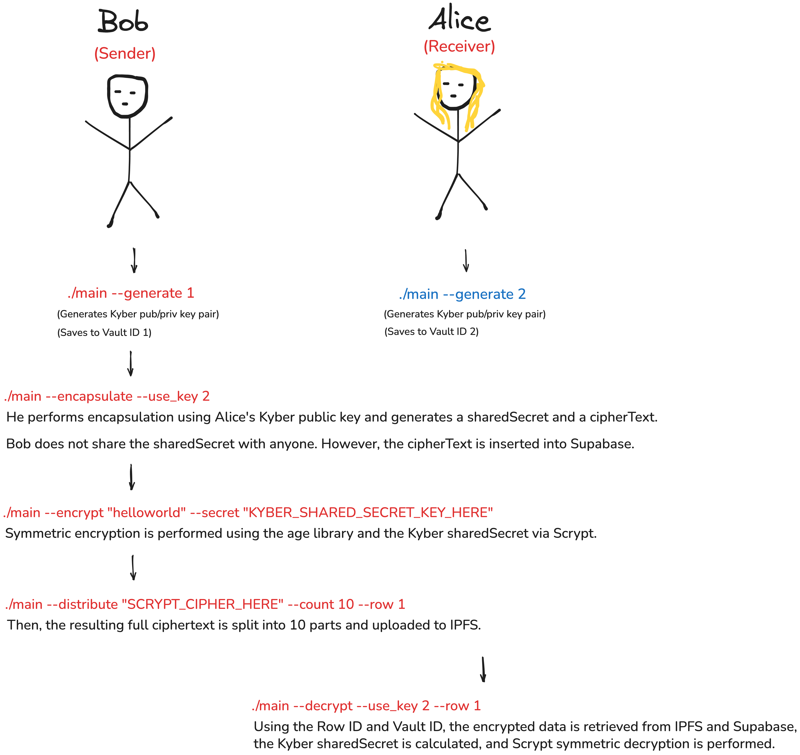

# 😭 cry2gather - let's enCRYpt together.

**Post-quantum secure, distributed encryption-decryption CLI tool**  
End-to-end secure data distribution with Kyber, age, IPFS, Vault, and Supabase integration.


---

## 🧩 Features

- ✅ Kyber512-based **quantum-resistant key pair generation**
- 🔐 **Symmetric encryption** with `age` using scrypt and shared secrets
- 🧬 **Post-quantum encapsulation** of shared secrets via Kyber
- ☁️ **Ciphertext sharding** and **IPFS upload** using Pinata
- 🗃️ **Resolver metadata** generation for reassembly
- 🏛️ **Key storage and retrieval** using HashiCorp Vault
- 🧪 **Supabase-based secret management** (ciphertext & shared secret)
- 🔓 **Secure decryption and reconstruction** from IPFS chunks

---

## 🧮 What You Asked For vs. What I Delivered

### 🔹 What You Asked For
- Encryption using **Libsodium**
- Optionally allowed to use **`age`** (mentioned during the meeting)
- A simple **encryption/decryption** CLI
- **Supabase**-based storage

### 🔸 What I Delivered
- I **did not use Libsodium**, because its Go implementation is severely outdated (last commits were ~7 years ago)
- Instead, I integrated **CRYSTALS-Kyber**, a NIST-standardized post-quantum algorithm
- I also added **symmetric encryption** using the `age` library with **scrypt-based** passphrases
- For distributed simulation, I **split ciphertext into multiple chunks** and uploaded them to **separate IPFS URLs**
- This makes it post-quantum **zero-trust**: even if a private key leaks, an attacker would need to:
  - know where each ciphertext chunk lives, AND
  - retrieve all of them, AND
  - break Kyber, OR
  - guess the symmetric passphrase
- By distributing ciphertext across nodes, even full access to one server is not enough
- Resolver metadata (which chunk is where) is **not stored online**, must be shared securely out-of-band
- I intended to build a real **distributed P2P node network**, but didn’t have time to write the infrastructure — I already have a helper tool named `distribRuted` that could’ve handled this
- I used **Pinata** instead of a local IPFS node, to avoid requiring reviewers to install and configure their own daemon
- I integrated **HashiCorp Vault** to handle key storage (Kyber public/private keys)

---

## 📌 Job Description Alignment

- **"Decentralized Data Security Framework (DDSF)"** → Simulated via IPFS chunking
- **"Blockchain-inspired distributed infrastructure"** → IPFS-backed chunk storage, detached resolver design
- **"Quantum-resistant encryption"** → Full Kyber integration with encapsulation/decapsulation
- **"Scalable integration and field deployment"** → CLI-based tool, no UI dependency, works on raw machines and you can divide the full ciphertext to as much as chunks you want
- **"Implement and refine quantum-resistant algorithms (Kyber, Dilithium...)"** → Implemented Kyber keygen and encapsulation
- **"Secure key management (Vault, AWS KMS...)"** → Vault support built-in
- **"Multi-layered encryption, zero-trust architecture"** → Kyber + age(scrypt), chunk isolation, resolver secrecy

---

## 🧠 Summary

I didn't just build a CLI tool. I implemented a **multi-layered, post-quantum secure, distributed encryption workflow** designed to simulate compromise-resilient, zero-trust environments. Every part — from the Kyber keygen, to chunking, to Supabase/Vault/IPFS integration — was chosen to reflect your spec and enhance it with actual threat-model awareness.


---

## 🚀 Quick Start

### Prerequisites
- Go 1.21 or newer
- age tool
- HashiCorp Vault (dev mode is enough)  
- Supabase project and anon key
- Pinata API key & secret (or another IPFS pinning service)

### 🧱 Architecture Overview


       [CLI] cry2gather
             │
             ├── Kyber512 ←→ HashiCorp Vault
             ├── age (scrypt) ←→ plaintext/ciphertext
             ├── Supabase ←→ shared secret & Kyber ciphertext
             └── IPFS (via Pinata) ←→ distributed ciphertext chunks

### 🔧 Build

```bash
go build -o cry2gather main.go
```

## Quick Demo

1. **Start Vault in dev mode**

        vault server -dev        # press CTRL+Z afterwards to background

2. **Generate a Kyber key-pair and store in Vault**

        ./main --generate 1

3. **Verify the key really exists in Vault**

        vault kv get --address=http://127.0.0.1:8200 secret/key/1

4. **Encapsulate a shared secret with the public key and push cipherText to Supabase**

        ./main --encapsulate --use_key 1

   Console prints:
   - sharedSecret (keep this private)
   - cipherText (automatically inserted to Supabase)

5. **Encrypt any plaintext with age + scrypt using the Kyber sharedSecret**

        ./main --encrypt "helloworld" --secret KYBER_SHARED_SECRET_KEY_HERE

   Output is a base64-encoded age ciphertext.

6. **Verify encryption by decrypting in the terminal**

        echo 'SCRYPT_CIPHER_HERE' | base64 -d | age --decrypt

   age prompts for a passphrase. Enter the same sharedSecret and plaintext is revealed.

7. **Shard the full ciphertext into 10 parts and upload to IPFS**

        ./main --distribute "SCRYPT_CIPHER_HERE" --count 10 --row 1

   - Ten IPFS CIDs are created via Pinata.
   - A resolver file named `resolver_1.txt` is written locally.

8. **Fetch everything back and decrypt**

        ./main --decrypt --use_key 1 --row 1

   - Pulls cipherText from Supabase.  
   - Retrieves private key from Vault.  
   - Calculates Kyber sharedSecret, downloads chunks from IPFS, reassembles, decrypts, and prints the original plaintext.

---

## 🎥 Usage Video

[▶️ Click to watch](video.mp4)

---

## Files Created
- `resolver_<row>.txt` — line-delimited CIDs with byte ranges
- Console output — sharedSecret (never stored), helpful status messages

---
